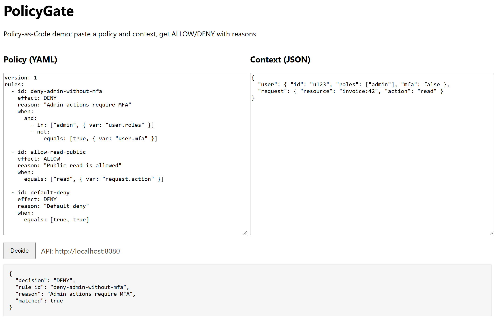

# PolicyGate


PolicyGate is a lightweight **Policy-as-Code** playground for evaluating YAML-based policies against JSON context and returning deterministic **ALLOW/DENY** decisions with traceable rule matches.

**Tech stack:** Rust (engine) + Axum (API) + React/Vite (web UI) + Docker Compose (local stack)

## Table of Contents

- [Quick Start (Windows)](#quick-start-windows)
- [What PolicyGate Does](#what-policygate-does)
- [Screenshot](#screenshot)
- [Endpoints](#endpoints)
- [License](#license)

## Quick Start (Windows)

### Requirements

- Docker Desktop installed and running

### Start

```powershell
git clone https://github.com/CarlJosef/policygate.git
cd policygate
docker compose up --build
```

### Open

- Web UI: [http://localhost:5173](http://localhost:5173)

### Stop

Press `Ctrl + C` in the terminal running Docker Compose, then run:

```powershell
docker compose down
```

## What PolicyGate Does

PolicyGate evaluates a **policy** written in YAML against a **context** provided as JSON.

The result is a deterministic decision:

- **ALLOW**
- **DENY**

The response also includes metadata such as the matched rule id and a human-friendly reason.

## Screenshot



## Endpoints

- Web UI: [http://localhost:5173](http://localhost:5173)
- API (POST): [http://localhost:8080/v1/decide](http://localhost:8080/v1/decide)

> Note: `/v1/decide` is a **POST** endpoint. Opening it directly in a browser will not work.

## License

MIT — see [LICENSE](LICENSE).
